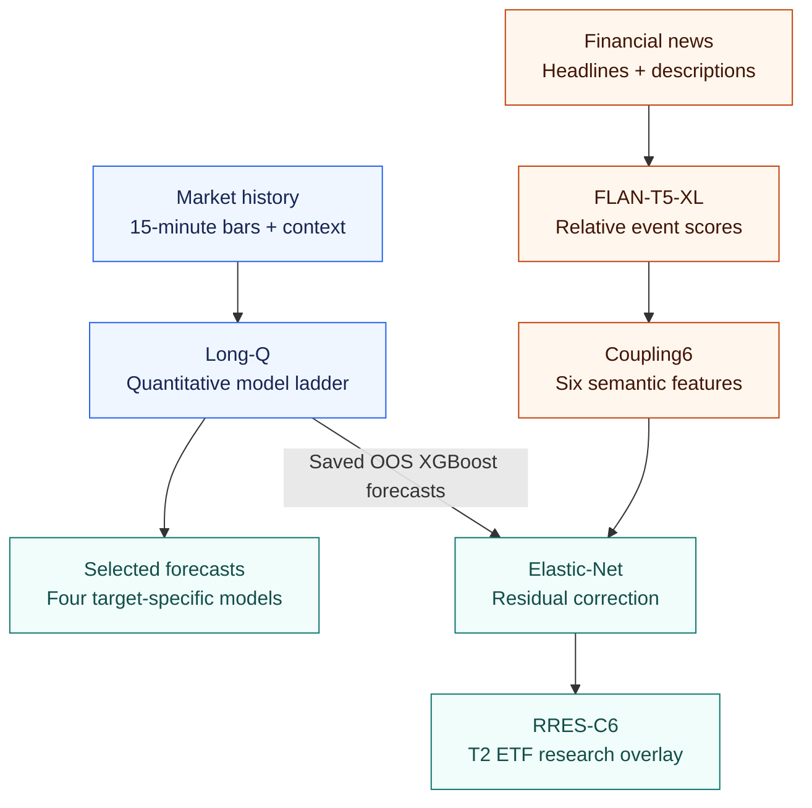

# Forecasting Stock–Sector Correlation

**Learning how tightly a stock moves with its sector, using market history and financial news.**

[Research design](#research-design) · [Architecture](#how-it-works) · [Results](#results) · [Get started](#get-started) · [Next improvements](#next-improvements)

A stock's relationship with its sector changes over time. Broad market news
can move companies together; a firm-specific event can pull one company away
from its peers. Forecasting this relationship matters for hedge construction,
diversification, and portfolio risk.

This project investigates two questions: **how much of future stock–sector
correlation can be predicted from market data, and does the meaning of
financial news improve that forecast?** It combines interpretable statistical
baselines, tree models, and a compact language-model-based correction in an
auditable, chronological research pipeline.

| Universe | Price history | Forecast horizons | Quant evaluation |
|---|---|---|---|
| **30 U.S. stocks · 5 sectors** | **2016–June 2026** | **1 and 5 sessions** | **13 half-year test folds** |

> **Main finding:** the four selected quantitative models reduce Fisher-z
> mean squared error by **22–39% versus persistence**. A six-feature news
> correction reduces MSE by **1.38%** on the five-session stock/ETF target versus its
> matched XGBoost baseline. These are retrospective development results;
> the exact comparisons are reported below.

## Research design

The prediction target is **realized correlation**: how closely a stock's
intraday returns move with a sector reference. Two horizons and two reference
portfolios produce four tasks:

| Target | Horizon | Sector reference | What it measures |
|---|---|---|---|
| **T1 ETF** | Current session | Sector exchange-traded fund | Same-day stock/fund coupling |
| **T1 LOO** | Current session | Equal-weight basket of the other five sector stocks | Same-day coupling to peers |
| **T2 ETF** | Current + next four sessions | Sector exchange-traded fund | Five-session stock/fund coupling |
| **T2 LOO** | Current + next four sessions | Equal-weight basket of the other five sector stocks | Five-session coupling to peers |

**LOO** means *leave one out*: the target stock is excluded from its peer
basket. The ETF reference represents a tradable sector exposure; the LOO
reference separates peer co-movement from the stock's own ETF membership.

Targets use aligned 15-minute regular-session returns, respecting official
trading calendars and early closes. T2 sums covariance and variance
components across all five sessions, then normalizes once. It is not an
average of five daily correlations.

Models learn in Fisher-z space, with correlations clipped away from the
endpoints for numerical stability, and predictions mapped back with the
inverse transform:

```math
z_{i,t}=\mathrm{atanh}\!\left(\mathrm{clip}(\rho_{i,t},-0.995,0.995)\right),
\qquad
\widehat\rho_{i,t}=\tanh(\widehat z_{i,t}).
```

## How it works

The quantitative branch learns persistent market structure. The news branch
tests whether target-relative event information explains some of the errors
left by an already out-of-sample quantitative forecast.



### 1. Learn the market-data baseline

**Long-Q** is the full-history quantitative experiment. Its 58,500 eligible
stock-date rows cover 2,136 dates from December 2017 to June 2026, after a
500-session feature warm-up. Inputs come from adjusted Alpaca SIP bars,
market/rate series, and official release calendars.

| Feature group | Information captured |
|---|---|
| **Core 22** | Daily, weekly, and monthly correlation/downside states; exponential pair and sector states |
| **Volatility and activity** | Realized volatility, relative volume, and within-sector return dispersion |
| **Extended hours** | Overnight and premarket returns/volume, prior aftermarket state, and availability flags |
| **Market context** | VIX, Treasury yields, and scheduled macro releases |

The model ladder compares persistence and HAR/SHAR regressions, OLS, LASSO,
Elastic Net, shallow XGBoost, linear/tree ensembles, and a DCC-GARCH
benchmark. HAR/SHAR summarize correlation at several time scales, including
downside behavior; DCC-GARCH supplies a conditional-correlation benchmark.
Regularized linear models provide compact baselines, while boosted trees
capture nonlinear interactions. Model selection is performed separately for
each target.

Completed-session features are lagged. Same-day premarket data and news use
the **09:00 ET information cutoff**; publication lags are applied to slower
market-context sources. Missing inputs have explicit availability handling.
See the [core feature equations](docs/bollerslev_core_features.md) and
[additional feature definitions](docs/additional_quant_features.md).

### 2. Represent news relative to the target stock

The semantic experiment uses Massive ordinary-news headlines and descriptions.
FLAN-T5-XL scores event classes from the supplied text; numerical forecasting
remains with the downstream statistical models. The latest experiment reuses
**50,488 cached article inferences**, so feature redesign and forecast
comparisons require no new language-model inference.

Scores from canonical and reversed label orders are normalized within each
order and averaged. These are **relative candidate weights**, rather than
calibrated event probabilities. Three event families—**operating/financial**,
**policy/corporate**, and **macro/market**—are aggregated across three
mutually exclusive roles:

- **Target-specific (I):** news about the stock being forecast.
- **Peer-specific (P):** news about another company in its sector.
- **Common (C):** sector-wide or macro news.

The resulting *SoftRoute19* representation contains nine current event/role
masses, nine changes relative to prior history, and a no-selected-article
flag. **Coupling6** compresses it into six predictors: common minus target-
and peer-specific mass for each event family, plus the corresponding change
from its historical baseline.

<details>
<summary><strong>The six-feature construction</strong></summary>

For stock $`i`$, date $`t`$, role $`r`$, and event family $`k`$, let $`p_{a,k}`$
be article $`a`$'s consensus score and $`w_{i,a,t}`$ its frozen recency and
duplication weight. The event/role mass is

```math
M_{i,t,r,k}=
\frac{\sum_a w_{i,a,t}\,\mathbf{1}[r_{i,a,t}=r]p_{a,k}}
{\sum_a w_{i,a,t}}.
```

The denominator includes all selected articles and the `other_or_unclear`
score class. For each mass, $`\Delta M`$ is its difference from a prior-only
63-session exponentially weighted baseline with a 21-session half-life.
The current session never enters that baseline. The six predictors are

```math
K_{i,t,k}=M_{i,t,C,k}-M_{i,t,I,k}-M_{i,t,P,k},
\qquad
\Delta K_{i,t,k}=\Delta M_{i,t,C,k}-\Delta M_{i,t,I,k}-\Delta M_{i,t,P,k}.
```

Three event families × two contrasts give six features. Full definitions and
aggregation rules are in the [methodology](docs/methodology.md).

</details>

### 3. Correct the remaining forecast error

**RRES-C6** fits an Elastic Net to earlier out-of-sample XGBoost forecast
errors using the six semantic predictors. It adds a validation-selected
fraction of that estimated error to the quantitative forecast:

```math
\widehat z^{\mathrm{RRES}}_{i,t}
=\widehat z^{Q,\mathrm{long}}_{i,t}
+\lambda\,\widehat e^{\mathrm{C6}}_{i,t},
\qquad \lambda\in\{0,0.25,0.5,0.75,1\}.
```

This keeps the long-history quantitative model as the anchor while learning
a small news correction from the shorter semantic sample. A shrinkage of
zero retains the original forecast. Residual training uses only earlier
out-of-sample errors, so the corrector never learns from in-sample quant fits.

The research progressed from deterministic news counts, through hard event
labels, to soft role-conditioned features and this compact residual model.
The [experiment index](experiments/README.md) and
[full comparison record](docs/results.md) retain the alternatives, ablations,
and controls behind that selection.

## Evaluation

The experiments follow an expanding-window design rather than random row
splits:

1. **Train on history, validate on the next six months, test on the following six months.**
   The quant ladder has 13 outer tests from 2020-H1 to 2026-H1; the long-Q
   semantic correction has five from 2024-H1 to 2026-H1.
2. **Keep each date together.** All stocks on a date stay in the same
   partition. Five-session targets crossing a partition boundary are purged.
3. **Fit preprocessing and tuning inside the fold.** Validation selects
   model settings and correction strength before the final test fit.
4. **Compare matched forecasts.** Semantic confidence intervals use 2,000
   paired moving-block resamples of whole dates, with ten-session blocks
   kept within each outer fold.

Primary selection uses Fisher-z RMSE. Raw-correlation error is also reported.
**Out-of-sample (OOS) R²** measures the reduction in Fisher-z mean squared
error relative to *persistence*, which carries forward the last available same-horizon
correlation state:

```math
R^2_{\mathrm{OOS}}=1-
\frac{\mathrm{MSE}_{\mathrm{model}}}{\mathrm{MSE}_{\mathrm{persistence}}}.
```

The test folds also inform the final ranking of model families, so the
selected results are development estimates. Prospective confirmation is a
[next improvement](#next-improvements).

## Results

### Selected quantitative models

| Target | Selected model | Test rows | Fisher-z RMSE ↓ | Correlation RMSE ↓ | OOS R² ↑ |
|---|---|---:|---:|---:|---:|
| **T1 ETF** | XGBoost | 44,058 | **0.3577** | 0.1894 | **0.3921** |
| **T1 LOO** | XGBoost | 44,058 | **0.3657** | 0.2118 | **0.3891** |
| **T2 ETF** | Elastic Net / XGBoost ensemble | 42,030 | **0.2330** | 0.1180 | **0.2200** |
| **T2 LOO** | Core-22 LASSO | 42,030 | **0.2427** | 0.1382 | **0.2404** |

XGBoost leads both same-day tasks; the five-session tasks favor an ensemble
for the ETF reference and a compact linear model for the peer basket. An
OOS R² of 0.3921 means approximately **39.21% lower MSE than persistence**.

Exact metrics and model routing are recorded in the
[active model registry](models/active/registry.json), with the complete
[quantitative ranking](experiments/quant_training/v2/comparisons/README.md)
available separately.

### Selected news correction: RRES-C6

| T2 ETF comparison | Result |
|---|---:|
| MSE reduction versus matched long-Q XGBoost | **1.3844%** |
| Paired 95% interval for that reduction | **[0.3429%, 2.6228%]** |
| Folds improved | **3 of 5** |
| Evaluation sample | **18,150 rows · 605 dates** |
| Fisher-z RMSE | **0.2278** |

RRES-C6 is selected for the **T2 ETF research route**. Its matched-base
comparison is statistically significant under the stored bootstrap, with
the gain concentrated in the later folds. Its anchor is XGBoost; the primary
T2 ETF model above is an ensemble evaluated on a longer sample. Their pooled
RMSE values therefore should not be compared directly. See the
[RRES-C6 model card](experiments/quant_deterministic_news/v4/training/models/rres_coupling6_en/RESULTS.md).

### Downstream economic experiment

A separate [stock/ETF convergence study](experiments/stock_etf_spread/v2/README.md)
tests the selected quant ensemble as a trading gate. The full-history
strategy returned **−2.73% annualized before costs** and **−9.78% at 2 basis
points per side**. This application remains a redesign task; the forecasting
results measure correlation accuracy, not a demonstrated profitable strategy.

## Get started

The public clone includes source code, protocols, tests, model cards, and
compact results. Downloaded market/news data, generated panels and predictions,
model weights, and credentials are kept outside Git. You can inspect the
research and verify the selected results without those large artifacts.

**Python 3.13 is the verified local environment.** Start with the CPU-capable
quantitative dependencies:

```shell
git clone https://github.com/GavinHuang0/correlation-forecast.git
cd correlation-forecast
```

<details open>
<summary><strong>Windows · PowerShell</strong></summary>

```powershell
py -3.13 -m venv .venv-training
.\.venv-training\Scripts\python.exe -m pip install --upgrade pip
.\.venv-training\Scripts\python.exe -m pip install -r requirements-quant.txt
.\.venv-training\Scripts\python.exe -m unittest tests.test_active_forecast_registry -v
```

</details>

<details>
<summary><strong>macOS / Linux · shell</strong></summary>

```bash
python3.13 -m venv .venv-training
.venv-training/bin/python -m pip install --upgrade pip
.venv-training/bin/python -m pip install -r requirements-quant.txt
.venv-training/bin/python -m unittest tests.test_active_forecast_registry -v
```

</details>

The verification command checks that the selected models and metrics match
the committed experiment summaries. In your editor, select the interpreter
inside `.venv-training`.

For full experiment reproduction, follow the
[data and training workflow](docs/reproducibility.md). Data acquisition needs
provider access; copy [`.env.example`](.env.example) to `.env` and fill in the
keys for the sources you use. FLAN-T5-XL extraction additionally requires
CUDA-enabled PyTorch, [`requirements-flan-t5-xl.txt`](requirements-flan-t5-xl.txt),
and the pinned model snapshot plus its verified manifest. The
[active extractor guide](experiments/flan_t5_xl/README.md) documents that
separate path. The v4 forecast experiments reuse cached article scores when
available.

## Explore the repository

| Start here | What you will find |
|---|---|
| [Methodology](docs/methodology.md) | Target equations, features, folds, semantic aggregation, and statistical tests |
| [Detailed results](docs/results.md) | Model comparisons, ablations, controls, and selection evidence |
| [Reproducibility](docs/reproducibility.md) | Build/train commands, artifact dependencies, hashes, and verification |
| [Active models](models/active/README.md) | Four quantitative routes and the selected semantic overlay |
| [Experiments](experiments/README.md) | Versioned research records, extractor studies, and economic tests |
| [`scripts/`](scripts/) · [`config/`](config/) | Data pipelines, model code, frozen protocols, and schemas |
| [`tests/`](tests/) · [`annotations/`](annotations/README.md) | Contract/leakage tests and public semantic reference labels |

The [documentation index](docs/README.md) provides the full reading map.
Generated artifacts are bound to recorded manifests and hashes; earlier
experiment paths remain stable so the evidence can be traced across versions.

## Next improvements

- **Prospective confirmation:** evaluate on an untouched period after
  June 2026 with versioned news, effective-dated universe membership, and
  balanced coverage.
- **Stronger semantics:** add direction, surprise, materiality, and novelty;
  complete C6-specific stale-news, wrong-stock, permutation, and quality controls.
- **Reusable inference:** serialize complete fitted preprocessing and model
  state alongside the existing configuration and artifact manifests.
- **Economic application:** test direct spread-return targets, lower-turnover
  execution, and position caps under a new preregistered protocol.
